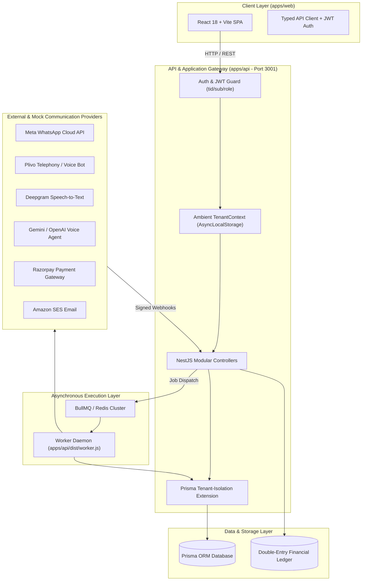
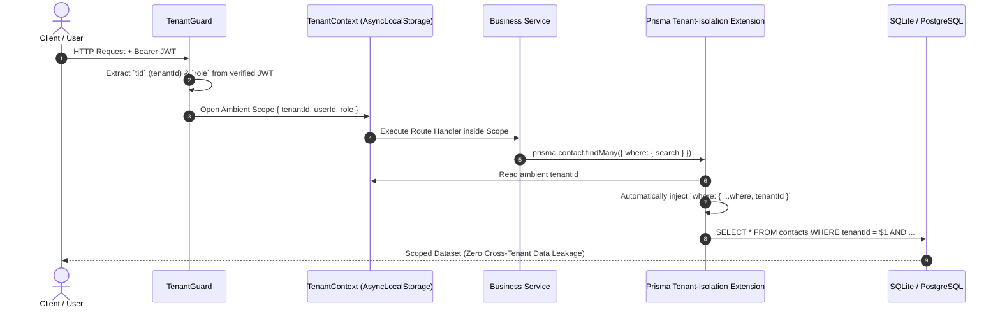
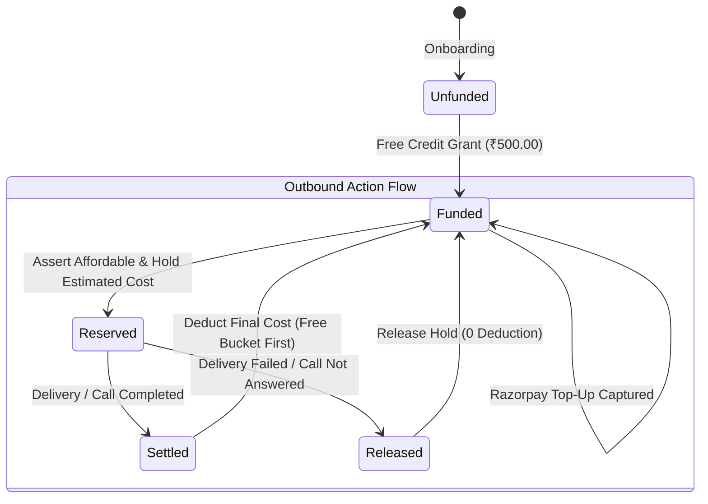
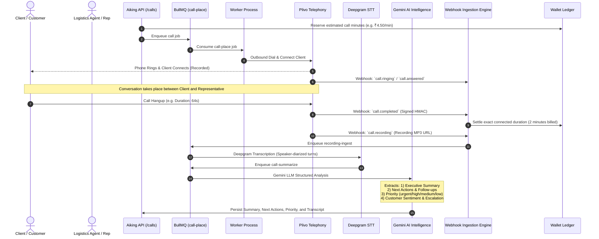
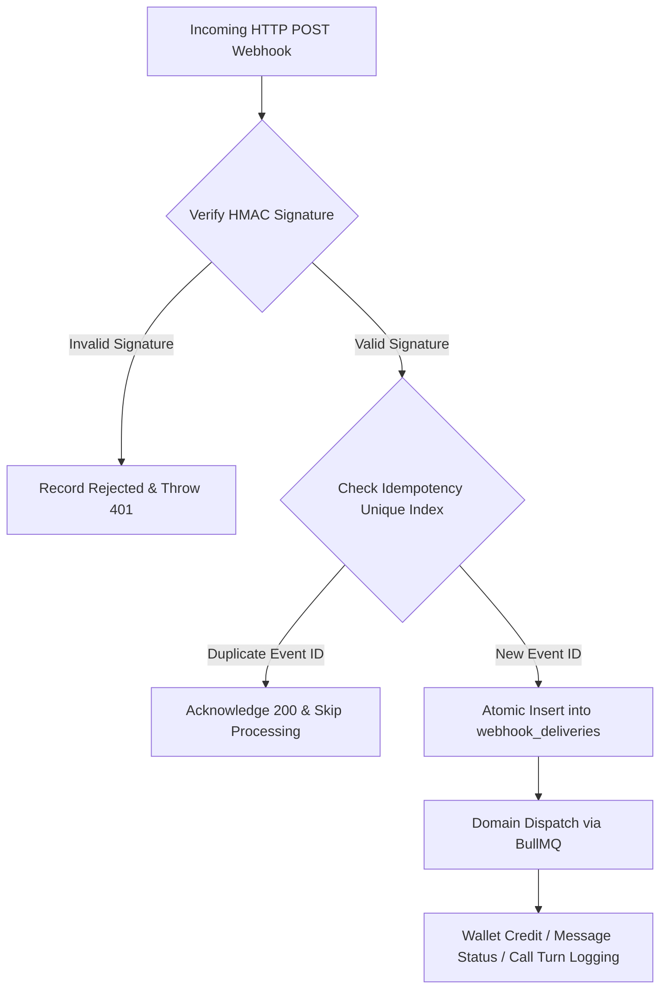
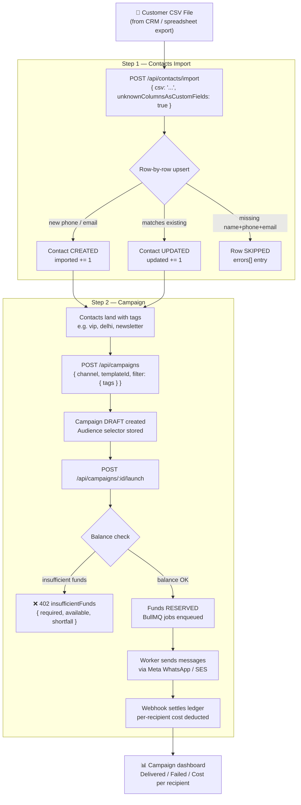
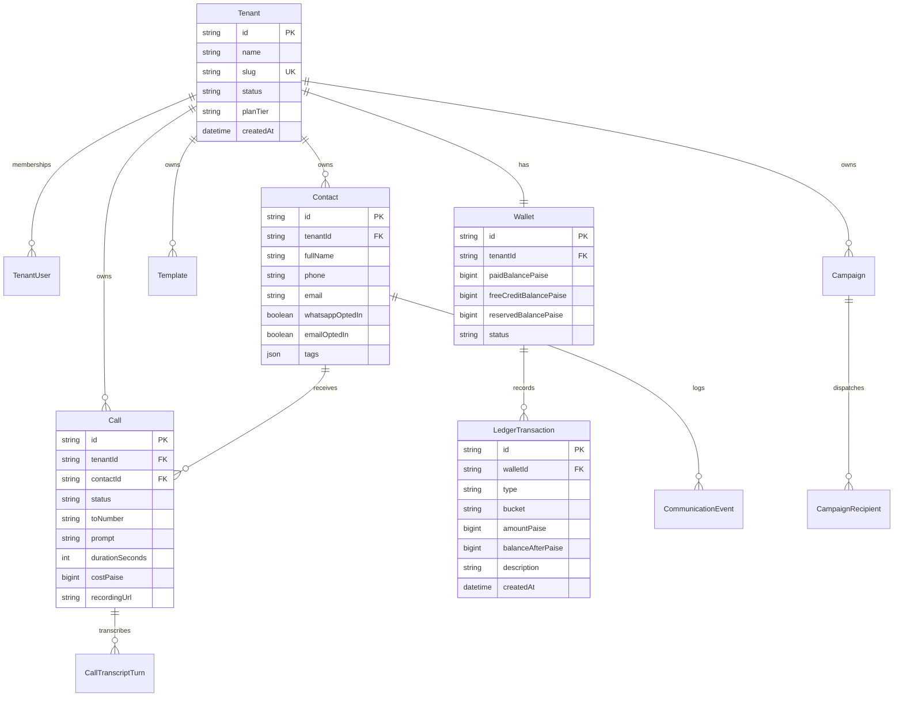

# Aiking Connect — Technical Architecture & Engineering Documentation

**Aiking Connect** is an enterprise multi-tenant AI customer communication, outbound conversational telephony, and marketing operations platform built with NestJS, React, TypeScript, BullMQ, Redis, and SQLite/PostgreSQL.

---

## 1. System Architecture Overview

The system is architected as an isolated monorepo with high separation of concerns:



---

## 2. Monorepo Project Structure

```
Aiking-Logistics/
├── apps/
│   ├── api/                     # NestJS Modular Backend Application
│   │   ├── src/
│   │   │   ├── common/          # Cross-cutting concerns
│   │   │   │   ├── auth/        # JWT payload & authentication guards
│   │   │   │   ├── tenant/      # Ambient TenantContext & AsyncLocalStorage
│   │   │   │   └── prisma/      # Database service with automated tenant isolation
│   │   │   ├── modules/         # Core business domain modules
│   │   │   │   ├── auth/        # Credentials, JWT tokens, and invitations
│   │   │   │   ├── tenants/     # Tenant lifecycle & suspension management
│   │   │   │   ├── contacts/    # CRM customer records & channel opt-ins
│   │   │   │   ├── timeline/    # 360° unified interaction timeline aggregator
│   │   │   │   ├── templates/   # Multi-channel parameterized template engine
│   │   │   │   ├── campaigns/   # Bulk broadcast campaign scheduler & dispatcher
│   │   │   │   ├── calls/       # Outbound conversational AI voice console
│   │   │   │   ├── wallet/      # Double-entry ledger, reservations & settlement
│   │   │   │   ├── billing/     # Top-up order generation & effective pricing
│   │   │   │   ├── queue/       # BullMQ job producers & consumer registration
│   │   │   │   ├── providers/   # Meta, Plivo, SES, Deepgram, Gemini adapters
│   │   │   │   └── webhooks/    # Cryptographic HMAC verification & deduplication
│   │   │   ├── main.ts          # API HTTP Server Entrypoint (Port 3001)
│   │   │   └── worker.ts        # Background BullMQ Worker Process
│   ├── web/                     # React 18 + Vite 6 Modern Frontend Portal
│   │   ├── src/
│   │   │   ├── api/             # Typed API Client & error handler
│   │   │   ├── context/         # AuthContext & 1-Click Fast Test Personas
│   │   │   ├── components/      # Glassmorphic AppShell, Modals & UI Widgets
│   │   │   ├── pages/           # Dashboard, Wallet, Contacts, Calls, Campaigns
│   │   │   ├── index.css        # Enterprise design system tokens & styles
│   │   │   ├── App.tsx          # React Router DOM routing & security boundaries
│   │   │   └── main.tsx         # DOM root mounter
│   │   └── vite.config.ts       # Vite proxy config (/api -> http://localhost:3001)
├── packages/
│   └── shared/                  # Universal TypeScript schemas, DTOs & contracts
│       └── src/
│           ├── contracts.ts     # Request/Response DTOs & Money types
│           ├── permissions.ts   # Role-based access control (RBAC) matrix
│           └── index.ts
└── scripts/
    ├── dev.mjs                  # Parallel runner starting API + Worker + Web
    └── test-api.mjs             # 28/28 assertions end-to-end regression test suite
```

---

## 3. Multi-Tenant Security & Isolation Model

Multi-tenancy is enforced **structurally** at the infrastructure layer, rather than relying on manual query filtering:



### Key Security Guarantees:
1. **JWT-Derived Tenancy**: The `tenantId` is never accepted from request query parameters or JSON body payloads.
2. **Ambient `AsyncLocalStorage`**: `TenantContext` maintains an ambient asynchronous context across every async tick.
3. **Prisma Middleware Filtering**: The database layer automatically intercepts all `findUnique`, `findMany`, `create`, `update`, and `delete` operations on tenant-scoped tables (`Contact`, `Campaign`, `Template`, `Call`, `Wallet`, `LedgerTransaction`).

---

## 4. Prepaid Wallet & Financial Ledger Engine

The platform operates on a **zero-overdraft double-entry accounting engine** with strict distinction between **Paid Balance** and **Promotional Free Balance**:



### Financial Rules:
- **Bucket Priority**: Deductions always deplete **Promotional Free Balance** before touching **Paid Balance**.
- **Two-Phase Commit**:
  1. **Phase 1 (Reservation)**: Prior to dispatching a WhatsApp broadcast or placing an AI call, funds are pre-reserved using an idempotency key.
  2. **Phase 2 (Settlement)**: Upon receiving verified provider delivery webhooks, the final cost is calculated and settled. If the message or call fails, the reservation is released with ₹0 loss to the tenant.
- **Double-Entry Audit**: Every rupee credited, reserved, or settled creates an immutable ledger entry with before/after balance checkpoints.

---

## 5. Plivo Client Call & Post-Call AI Intelligence Pipeline

The platform connects calls to clients via Plivo, records the conversation, transcribes it via Deepgram STT, and uses Gemini AI to analyze the transcript to generate an executive call summary, concrete next actions, priority classification, and sentiment:



### Post-Call Intelligence Attributes:
- **Executive Call Summary**: 2–3 sentence factual synthesis of discussion points and agreements.
- **Action Items & Next Actions**: Concrete follow-ups with dates/commitments (e.g., "Reschedule package delivery to Friday 3 PM", "Update delivery address to Building B").
- **Priority Tier**:
  - `urgent`: Delivery disputes, angry clients, severe delays, or escalated issues.
  - `high`: Rescheduled deliveries, address changes, pending payments requiring same-day action.
  - `medium`: General inquiries, delivery window verifications with standard follow-up.
  - `low`: Routine confirmations, successful handovers with no further action required.
- **Sentiment & Escalation**: Sentiment score (`positive`, `neutral`, `negative`) and human intervention trigger when managerial escalation is required.

---

## 6. Cryptographic Webhook Ingestion & Deduplication

Webhooks from external providers (Meta WhatsApp, Plivo V3, Razorpay, Amazon SES) are ingested through a unified security pipeline:



### Provider Verification Standards:
- **Meta WhatsApp**: HMAC-SHA256 signature against `X-Hub-Signature-256`.
- **Plivo**: Plivo V3 HMAC-SHA256 signature calculated over URL + Nonce.
- **Razorpay**: HMAC-SHA256 calculated over the exact raw body string using the shared webhook secret.
- **Amazon SES**: SNS message signature certificate chain validation.

---

## 7. Running a Campaign from a CSV File

The platform supports a full **CSV-driven outbound campaign** workflow: upload a customer
list as a CSV file, have contacts upserted into the CRM, and immediately target those
same contacts with a WhatsApp or Email broadcast — all without any manual data entry.

### 7.1 Step 1 — Import Contacts from CSV

**Endpoint**: `POST /api/contacts/import`  
**Permission required**: `CONTACTS_MANAGE` (Manager or Super Admin)  
**Content-Type**: `application/json`

The CSV content is sent as plain text inside a JSON envelope so the endpoint is driveable
from `curl` and the API Swagger UI without requiring a file upload form:

```json
{
  "csv": "<raw CSV text here>",
  "unknownColumnsAsCustomFields": true
}
```

#### CSV Column Reference

| Column | Required | Notes |
|:---|:---:|:---|
| `fullName` / `full_name` / `name` | ✅ | Contact's display name |
| `phone` / `mobile` / `phoneNumber` | ✅* | E.164 auto-normalized; assumed `+91` for 10-digit Indian numbers |
| `email` / `emailAddress` | ✅* | Lowercased and trimmed; stored as `null` if blank |
| `tags` | ❌ | Semicolon- or pipe-separated list (e.g. `vip;delhi`) |
| `whatsappOptedIn` | ❌ | `true`, `yes`, `1`, `opted_in` evaluate to `true` |
| `emailOptedIn` | ❌ | Same boolean coercion; defaults to `true` on new contacts |
| Any other column | ❌ | Stored as `customFields` when `unknownColumnsAsCustomFields` is `true` |

> [!IMPORTANT]
> At least one of `phone` or `email` is required per row. Rows missing both are counted in
> `skipped` with a per-row error message, not in `imported`.

#### Upsert Semantics

- The import matches on **phone first, then email**. An existing contact that matches is
  **updated** (fields merged, tags unioned), not duplicated.
- A fresh phone/email pair creates a new contact.
- Unknown / extra columns become `customFields` entries, merging into — not replacing —
  the existing custom field map.

#### Sample CSV

```csv
fullName,phone,email,tags,whatsappOptedIn,city
Priya Sharma,9876543210,priya@example.com,vip;delhi,yes,Delhi
Rahul Verma,+919123456789,,lead,true,Mumbai
Ananya Bose,,ananya@example.com,newsletter,false,Kolkata
```

#### Response

```json
{
  "imported": 2,
  "updated": 1,
  "skipped": 0,
  "errors": []
}
```

| Field | Description |
|:---|:---|
| `imported` | New contacts created |
| `updated` | Existing contacts enriched |
| `skipped` | Rows that could not be processed (see `errors`) |
| `errors` | Array of `{ row, message }` objects — one per bad row; partial success is normal |

> [!NOTE]
> The import is row-by-row (not a single `createMany`), so a single bad row does **not**
> abort the rest of the file. The limit is **5 000 rows per request**.

---

### 7.2 Step 2 — Create and Launch the Campaign

Once contacts are imported, target the newly tagged segment with a campaign. The
two-step Create → Launch pattern lets you preview the audience and estimated cost before
committing spend.

#### 7.2.1 Create Campaign (Draft)

`POST /api/campaigns`

```json
{
  "name": "Diwali Offer — Delhi VIPs",
  "channel": "WHATSAPP",
  "templateId": "<approved-template-id>",
  "filter": { "tags": ["vip", "delhi"] },
  "scheduledAt": "2024-10-31T18:00:00.000Z"
}
```

| Audience selector | When to use |
|:---|:---|
| `contactIds: ["id1", "id2"]` | Exact list of contact IDs (from previous import response) |
| `filter.tags: ["vip"]` | All contacts bearing **all** listed tags |
| `filter.all: true` | Every opted-in contact in the tenant |

#### 7.2.2 Launch Campaign

`POST /api/campaigns/:campaignId/launch`

The launch endpoint:
1. Re-validates the template is still approved and channel-matched.
2. Resolves the audience (applying opt-out filters at launch time).
3. Asserts the wallet balance covers the estimated cost — returns `insufficientFunds`
   with the shortfall amount if not.
4. Atomically reserves funds and enqueues one BullMQ job per recipient.

```json
{
  "campaignId": "cmp_abc123",
  "status": "QUEUED",
  "queuedRecipients": 47,
  "estimatedCost": { "paise": 14100, "rupees": "141.00" }
}
```

---

### 7.3 End-to-End CSV Campaign Flow



---

### 7.4 Quick `curl` End-to-End Example

```bash
# 1. Authenticate (get a JWT)
TOKEN=$(curl -s -X POST http://localhost:3001/api/auth/login \
  -H 'Content-Type: application/json' \
  -d '{"email":"manager@demo.example","password":"demo123"}' \
  | jq -r .accessToken)

# 2. Import contacts from CSV
curl -X POST http://localhost:3001/api/contacts/import \
  -H "Authorization: Bearer $TOKEN" \
  -H 'Content-Type: application/json' \
  -d '{
    "csv": "fullName,phone,tags\nPriya Sharma,9876543210,vip\nRahul Verma,9123456789,vip",
    "unknownColumnsAsCustomFields": true
  }'
# → { "imported": 2, "updated": 0, "skipped": 0, "errors": [] }

# 3. Create a draft campaign targeting the "vip" tag
CAMPAIGN_ID=$(curl -s -X POST http://localhost:3001/api/campaigns \
  -H "Authorization: Bearer $TOKEN" \
  -H 'Content-Type: application/json' \
  -d '{
    "name": "VIP Offer Blast",
    "channel": "WHATSAPP",
    "templateId": "<your-template-id>",
    "filter": { "tags": ["vip"] }
  }' | jq -r .id)

# 4. Launch it
curl -X POST http://localhost:3001/api/campaigns/$CAMPAIGN_ID/launch \
  -H "Authorization: Bearer $TOKEN" \
  -H 'Content-Type: application/json'
# → { "status": "QUEUED", "queuedRecipients": 2, "estimatedCost": { ... } }
```

---

## 8. Database Entity-Relationship (ER) Schema


