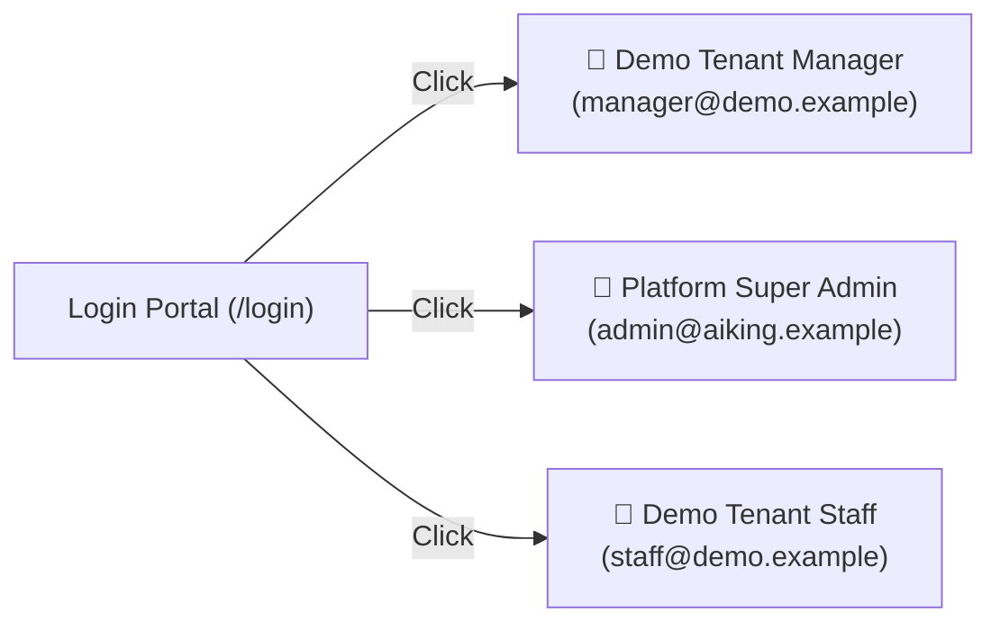
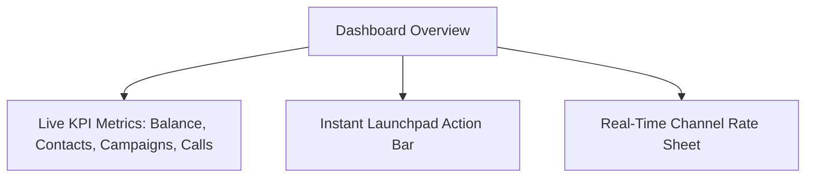
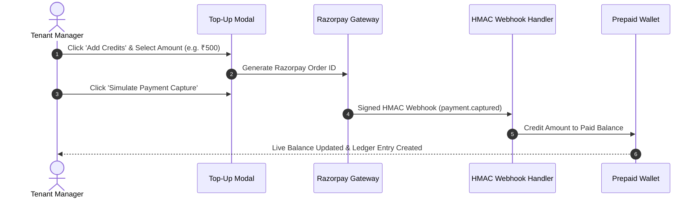
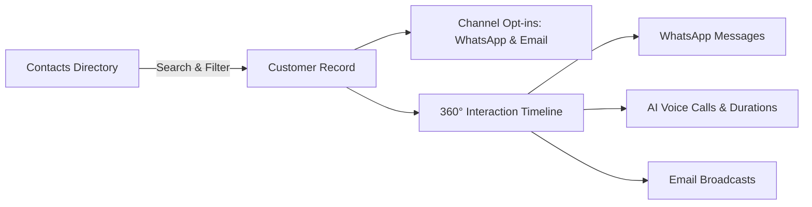
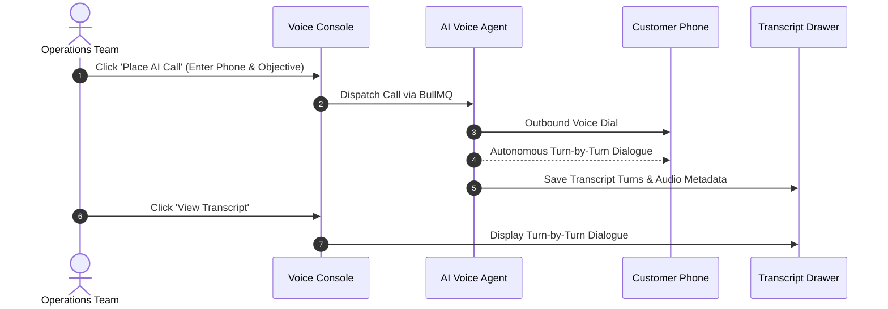
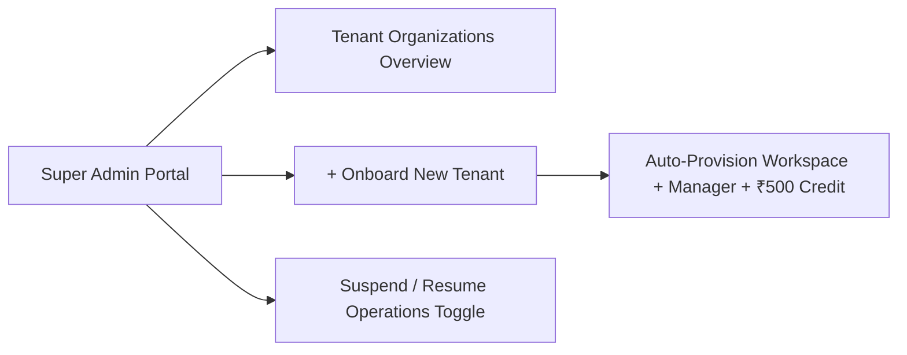

# Aiking Connect — User Guide & Feature Manual

Welcome to **Aiking Connect**, the enterprise platform for autonomous AI phone calls, multi-channel WhatsApp/Email campaigns, prepaid wallet management, and 360° customer relationship history.

---

## 1. User Roles & Access Matrix

| Role | Access Level | Capabilities |
| :--- | :--- | :--- |
| 👑 **Platform Super Admin** | Platform-wide | Onboard new tenant organizations, suspend/resume organizations, view cross-tenant billing & system health. |
| 🏢 **Tenant Manager** | Organization | Full operations: manage prepaid wallet & Razorpay top-ups, dispatch AI phone calls, launch broadcast campaigns, manage CRM contacts and templates. |
| 👤 **Tenant Staff** | Organization | Create & manage CRM contacts, view 360° communication timeline feeds, compose templates. |

---

## 2. ⚡ Fast-Track Testing with 1-Click Personas

On the login page (**[http://localhost:3000/login](http://localhost:3000/login)**), you can instantly log in without typing credentials by clicking any of the fast personas:



> [!TIP]
> You can also switch personas on the fly at any time from within the application using the **Switch Persona** dropdown located in the top navigation bar!

---

## 3. Core Features Walkthrough

### 📊 1. Executive Dashboard (`/`)

The central operational console for your organization:



- **Live Balance Card**: Displays active usable balance (promotional welcome credit + paid balance).
- **Instant Launchpad**: One-click triggers to place AI calls, launch broadcasts, add contacts, or top up wallet.
- **Channel Rate Sheet**: Live pricing per channel (WhatsApp @ ₹0.75/msg, AI Voice Calls @ ₹4.50/min, Email @ ₹0.10/msg).

---

### 💳 2. Prepaid Wallet & Razorpay Top-Up Gateway (`/wallet`)

Aiking Connect utilizes a prepaid financial engine with zero hidden fees:



#### How to Top Up:
1. Navigate to **Wallet & Billing** (`/wallet`) or click **Top Up** in the top navbar.
2. Select a preset amount (₹100, ₹500, ₹1,000, ₹5,000) or enter a custom amount.
3. Click **Proceed to Pay** to generate the order.
4. Click **Simulate Payment Capture** to execute the verified webhook simulation.
5. Your balance will be credited instantly and recorded in the **Double-Entry Transaction Ledger**.

---

### 👥 3. Contacts CRM & 360° Interaction Timeline (`/contacts`, `/contacts/:id`)

Comprehensive customer management with multi-channel permission tracking:



#### How to Add a Contact:
1. In the sidebar, open **Contacts CRM** (`/contacts`).
2. Click **+ Add Contact** at the top right.
3. Enter customer name, E.164 phone number (e.g. `+919876543210`), optional email, tags, and channel opt-in checkboxes.
4. Click **Save Contact**.

#### How to View the 360° Timeline:
1. Click on any contact row in the table.
2. The **360° Interaction Timeline** displays all historical interactions in chronological order with channel badges, timestamps, and call durations.
3. Click **Place AI Call to Customer** to immediately trigger an outbound AI phone call to this customer.

---

### 📞 4. Outbound AI Voice Telephony Console (`/calls`)

Autonomous conversational AI voice agents that dial customers, conduct dialogues, and transcribe conversations:



#### How to Dispatch an AI Call:
1. Open **AI Voice Calls** (`/calls`).
2. Click **+ Place AI Call**.
3. Specify the recipient phone number and the AI agent's objective (e.g. *"Confirm afternoon delivery address for shipment #AGI-8492"*).
4. Click **Place Call Now**.
5. When the call finishes, click **View Transcript** on the call row to inspect the complete conversation dialogue between the AI agent and the customer.

---

### 📨 5. Templates & Broadcast Campaigns (`/templates`, `/campaigns`)

Broadcast bulk messages across WhatsApp and Email:

```mermaid
graph TD
    TPL[Templates Studio] -->|Define Variables: {{fullName}}| COMPOSE[Parameterized Message]
    COMPOSE --> CAMP[Broadcast Campaign Launcher]
    CAMP -->|Select Audience| DISPATCH[Asynchronous BullMQ Queue]
    DISPATCH --> ANALYTICS[Delivery Tracking: 100% Processed]
```

#### How to Create a Template:
1. Open **Templates** (`/templates`) and click **+ Create Template**.
2. Choose **WhatsApp** or **Email**, specify a name, and enter content with dynamic placeholder tags (e.g. `{{fullName}}`, `{{orderId}}`).
3. Click **Save Template**.

#### How to Launch a Campaign:
1. Open **Campaigns** (`/campaigns`) and click **+ Launch Campaign**.
2. Enter a campaign name, choose the channel, and select an approved template.
3. Click **Launch Campaign Now** — the campaign targets all opted-in CRM contacts and delivers messages through background queues.

---

### 🏢 6. Multi-Tenant Organization Management (`/tenants`)

Super Admin tools for platform scaling:



#### How to Onboard a New Tenant:
1. Log in as **Platform Super Admin**.
2. Open **Tenants (Admin)** (`/tenants`).
3. Click **+ Onboard New Tenant**.
4. Fill in the organization name, manager details, and promotional credit allocation.
5. Click **Onboard Organization Now**. The new tenant can log in immediately with their credentials!
